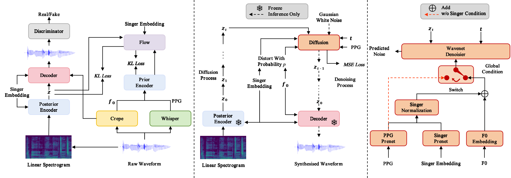

# 
 LDM-SVC: Latent Diffusion Model Based Zero-Shot Any-to-Any Singing Voice Conversion with Singer Guidance 

## Abstract

 Any-to-any singing voice conversion is a novel audio editing technique, aiming to convert the singing voice of one singer into that of another, given only a few seconds of singing data. However, during the conversion process, the issue of timbre leakage is inevitable: the converted singing voice still sounds like the original singer's voice. To better address the issue of timbre leakage, we propose the LDM-SVC method, which attempts to perform singing voice conversion in the latent space using a latent diffusion model. We trained a Variational Autoencoder structure using the noted open-source So-VITS-SVC project based on the VITS framework, and used this for our latent diffusion model training. Furthermore, we proposed a singer guidance training method, using a classifier-free inference method to further suppress the timbre of the original singer. Experiments show that our proposed method outperforms previous methods in both subjective and objective evaluations of timbre similarity.

 

<body>

 

<h1>Seen singer conversion</h1>

<h2>Male to Male</h2>
<h3>
  Target singer: 
    <audio src="samples/seen/M2M/ref/M2M-0.wav" controls="controls"></audio> 
    Source singer: 
    <audio src="samples/seen/M2M/src/M2M-0.wav" controls="controls"></audio> 
      Converted wav:  
    FastSVC: 
    <audio src="samples/seen/M2M/0/M2M-0.wav" controls="controls"></audio>
    DiffSVC:
    <audio src="samples/seen/M2M/1/M2M-0.wav" controls="controls"></audio> 
    So-VITS-SVC: 
    <audio src="samples/seen/M2M/2/M2M-0.wav" controls="controls"></audio>
    + LDM:
    <audio src="samples/seen/M2M/3/M2M-0.wav" controls="controls"></audio> 
    + Singer Guidance 
    <audio src="samples/seen/M2M/4/M2M-0.wav" controls="controls"></audio>   
</h3>

   

<h2>Female to Male</h2>
<h3>

  Target singer: 
    <audio src="samples/seen/F2M/ref/F2M-0.wav" controls="controls"></audio> 
    Source singer: 
    <audio src="samples/seen/F2M/src/F2M-0.wav" controls="controls"></audio> 
      Converted wav:  
    FastSVC: 
    <audio src="samples/seen/F2M/0/F2M-0.wav" controls="controls"></audio>
    DiffSVC:
    <audio src="samples/seen/F2M/1/F2M-0.wav" controls="controls"></audio> 
    So-VITS-SVC: 
    <audio src="samples/seen/F2M/2/F2M-0.wav" controls="controls"></audio>
    + LDM:
    <audio src="samples/seen/F2M/3/F2M-0.wav" controls="controls"></audio> 
    + Singer Guidance 
    <audio src="samples/seen/F2M/4/F2M-0.wav" controls="controls"></audio>   
</h3>

   

<h2>Female to Female</h2>
<h3>

  Target singer: 
    <audio src="samples/seen/F2F/ref/F2F-0.wav" controls="controls"></audio> 
    Source singer: 
    <audio src="samples/seen/F2F/src/F2F-0.wav" controls="controls"></audio> 
      Converted wav:  
    FastSVC: 
    <audio src="samples/seen/F2F/0/F2F-0.wav" controls="controls"></audio>
    DiffSVC:
    <audio src="samples/seen/F2F/1/F2F-0.wav" controls="controls"></audio> 
    So-VITS-SVC: 
    <audio src="samples/seen/F2F/2/F2F-0.wav" controls="controls"></audio>
    + LDM:
    <audio src="samples/seen/F2F/3/F2F-0.wav" controls="controls"></audio> 
    + Singer Guidance 
    <audio src="samples/seen/F2F/4/F2F-0.wav" controls="controls"></audio>   
</h3>

   

<h2>Male to Female</h2>
<h3>

  Target singer: 
    <audio src="samples/seen/M2F/ref/M2F-0.wav" controls="controls"></audio> 
    Source singer: 
    <audio src="samples/seen/M2F/src/M2F-0.wav" controls="controls"></audio> 
      Converted wav:  
    FastSVC: 
    <audio src="samples/seen/M2F/0/M2F-0.wav" controls="controls"></audio>
    DiffSVC:
    <audio src="samples/seen/M2F/1/M2F-0.wav" controls="controls"></audio> 
    So-VITS-SVC: 
    <audio src="samples/seen/M2F/2/M2F-0.wav" controls="controls"></audio>
    + LDM:
    <audio src="samples/seen/M2F/3/M2F-0.wav" controls="controls"></audio> 
    + Singer Guidance 
    <audio src="samples/seen/M2F/4/M2F-0.wav" controls="controls"></audio>   
</h3>

 

<h1>Zero-shot unseen singer conversion</h1>

<h2>Male to Male</h2>
<h3>
  Target singer: 
    <audio src="samples/unseen/M2M/ref/M2M-0.wav" controls="controls"></audio> 
    Source singer: 
    <audio src="samples/unseen/M2M/src/M2M-0.wav" controls="controls"></audio> 
      Converted wav:  
    FastSVC: 
    <audio src="samples/unseen/M2M/0/M2M-0.wav" controls="controls"></audio>
    DiffSVC:
    <audio src="samples/unseen/M2M/1/M2M-0.wav" controls="controls"></audio> 
    So-VITS-SVC: 
    <audio src="samples/unseen/M2M/2/M2M-0.wav" controls="controls"></audio>
    + LDM:
    <audio src="samples/unseen/M2M/3/M2M-0.wav" controls="controls"></audio> 
    + Singer Guidance 
    <audio src="samples/unseen/M2M/4/M2M-0.wav" controls="controls"></audio>   
</h3>

   

<h2>Female to Male</h2>
<h3>

  Target singer: 
    <audio src="samples/unseen/F2M/ref/F2M-0.wav" controls="controls"></audio> 
    Source singer: 
    <audio src="samples/unseen/F2M/src/F2M-0.wav" controls="controls"></audio> 
      Converted wav:  
    FastSVC: 
    <audio src="samples/unseen/F2M/0/F2M-0.wav" controls="controls"></audio>
    DiffSVC:
    <audio src="samples/unseen/F2M/1/F2M-0.wav" controls="controls"></audio> 
    So-VITS-SVC: 
    <audio src="samples/unseen/F2M/2/F2M-0.wav" controls="controls"></audio>
    + LDM:
    <audio src="samples/unseen/F2M/3/F2M-0.wav" controls="controls"></audio> 
    + Singer Guidance 
    <audio src="samples/unseen/F2M/4/F2M-0.wav" controls="controls"></audio>   
</h3>

   

<h2>Female to Female</h2>
<h3>

  Target singer: 
    <audio src="samples/unseen/F2F/ref/F2F-0.wav" controls="controls"></audio> 
    Source singer: 
    <audio src="samples/unseen/F2F/src/F2F-0.wav" controls="controls"></audio> 
      Converted wav:  
    FastSVC: 
    <audio src="samples/unseen/F2F/0/F2F-0.wav" controls="controls"></audio>
    DiffSVC:
    <audio src="samples/unseen/F2F/1/F2F-0.wav" controls="controls"></audio> 
    So-VITS-SVC: 
    <audio src="samples/unseen/F2F/2/F2F-0.wav" controls="controls"></audio>
    + LDM:
    <audio src="samples/unseen/F2F/3/F2F-0.wav" controls="controls"></audio> 
    + Singer Guidance 
    <audio src="samples/unseen/F2F/4/F2F-0.wav" controls="controls"></audio>   
</h3>

 
  

<h2>Male to Female</h2>
<h3>

  Target singer: 
    <audio src="samples/unseen/M2F/ref/M2F-0.wav" controls="controls"></audio> 
    Source singer: 
    <audio src="samples/unseen/M2F/src/M2F-0.wav" controls="controls"></audio> 
      Converted wav:  
    FastSVC: 
    <audio src="samples/unseen/M2F/0/M2F-0.wav" controls="controls"></audio>
    DiffSVC:
    <audio src="samples/unseen/M2F/1/M2F-0.wav" controls="controls"></audio> 
    So-VITS-SVC: 
    <audio src="samples/unseen/M2F/2/M2F-0.wav" controls="controls"></audio>
    + LDM:
    <audio src="samples/unseen/M2F/3/M2F-0.wav" controls="controls"></audio> 
    + Singer Guidance 
    <audio src="samples/unseen/M2F/4/M2F-0.wav" controls="controls"></audio>   
</h3>

 