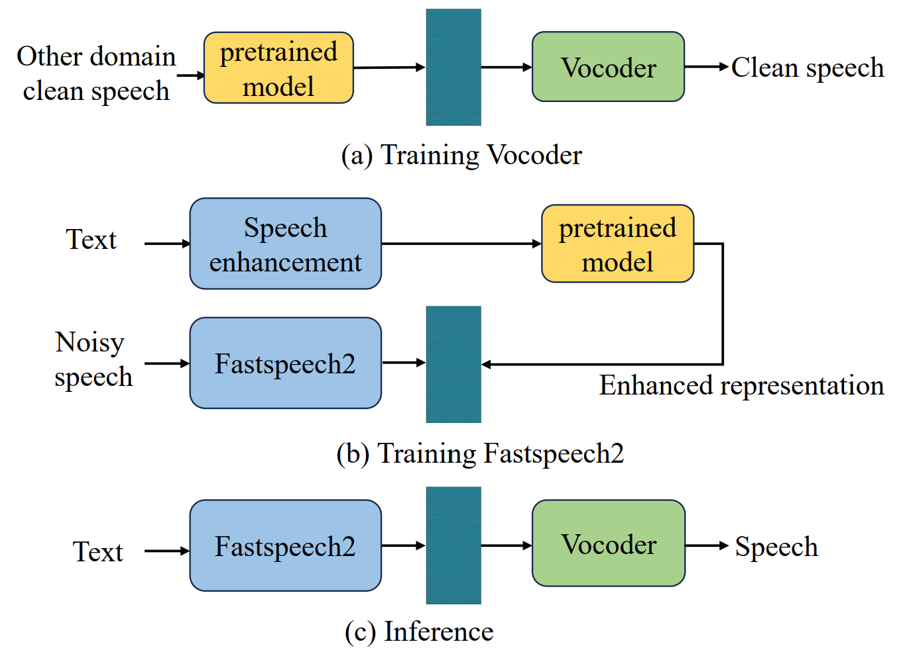

# 
 An Experimental Comparison of Noise Robust Text-to-speech Synthesis Systems Based on Self-supervised Representation 

## Abstract

 With the advancements in deep learning, text-to-speech (TTS) techniques utilizing clean speech have witnessed significant performance improvements. The data collected from real scenes often contain noise and generally needs to be denoised by speech enhancement models. TTS models trained on enhanced speech suffer from speech distortion and background noise, which thus affect the quality of synthesized speech. On the other hand, self-supervised pre-trained models have shown excellent noise robustness in various speech tasks, indicating that the learned representation is more tolerant to noise perturbations. Our previous work has demonstrated the superior noise robustness of WavLM representations for speech synthesis. However, the impact of different self-supervised representations on speech synthesis performance remains unknown. In this paper, we systematically compare the performance of four self-supervised representations, WavLM, Wav2vec2.0, HuBERT, and data2vec, using a HiFi-GAN-based representation-to-waveform vocoder and a Fastspeech-based text-to-representation acoustic model. Second, on the basis of our discovery that the representations have better noise and speaker information suppression, we further integrate speaker embedding to realize voice conversion tasks. Finally, experimental results on the LJSpeech and LibriTTS datasets demonstrate the effectiveness of the method.

 

<body>

<h1>Ground Truth </h1>

<h3>
    <audio src="https://github.com/zzftts/zzftts.github.io/raw/main/ground_truth/LJ005-0218.wav" controls="controls"></audio> 
    <audio src="https://github.com/zzftts/zzftts.github.io/raw/main/ground_truth/LJ007-0143.wav" controls="controls"></audio> 
    <audio src="https://github.com/zzftts/zzftts.github.io/raw/main/ground_truth/LJ008-0295.wav" controls="controls"></audio> 
    <audio src="https://github.com/zzftts/zzftts.github.io/raw/main/ground_truth/LJ016-0027.wav" controls="controls"></audio> 
    <audio src="https://github.com/zzftts/zzftts.github.io/raw/main/ground_truth/LJ019-0057.wav" controls="controls"></audio>
    <audio src="https://github.com/zzftts/zzftts.github.io/raw/main/ground_truth/LJ029-0061.wav" controls="controls"></audio> 
    <!-- <audio src="https://github.com/zzftts/zzftts.github.io/raw/main/ground_truth/LJ033-0170.wav" controls="controls"></audio> 
    <audio src="https://github.com/zzftts/zzftts.github.io/raw/main/ground_truth/LJ035-0157.wav" controls="controls"></audio> 
    <audio src="https://github.com/zzftts/zzftts.github.io/raw/main/ground_truth/LJ036-0163.wav" controls="controls"></audio> 
    <audio src="https://github.com/zzftts/zzftts.github.io/raw/main/ground_truth/LJ040-0175.wav" controls="controls"></audio> -->
</h3>

 

<h1>Noisy speech </h1>

<h3>
    <audio src="https://github.com/zzftts/zzftts.github.io/raw/main/noisy/LJ005-0218.wav" controls="controls"></audio> 
    <audio src="https://github.com/zzftts/zzftts.github.io/raw/main/noisy/LJ007-0143.wav" controls="controls"></audio> 
    <audio src="https://github.com/zzftts/zzftts.github.io/raw/main/noisy/LJ008-0295.wav" controls="controls"></audio> 
    <audio src="https://github.com/zzftts/zzftts.github.io/raw/main/noisy/LJ016-0027.wav" controls="controls"></audio> 
    <audio src="https://github.com/zzftts/zzftts.github.io/raw/main/noisy/LJ019-0057.wav" controls="controls"></audio>
    <audio src="https://github.com/zzftts/zzftts.github.io/raw/main/noisy/LJ029-0061.wav" controls="controls"></audio> 
    <!-- <audio src="https://github.com/zzftts/zzftts.github.io/raw/main/noisy/LJ033-0170.wav" controls="controls"></audio> 
    <audio src="https://github.com/zzftts/zzftts.github.io/raw/main/noisy/LJ035-0157.wav" controls="controls"></audio> 
    <audio src="https://github.com/zzftts/zzftts.github.io/raw/main/noisy/LJ036-0163.wav" controls="controls"></audio> 
    <audio src="https://github.com/zzftts/zzftts.github.io/raw/main/noisy/LJ040-0175.wav" controls="controls"></audio> -->
</h3>

<h1>Enhanced speech </h1>

<h3>
    <audio src="https://github.com/zzftts/zzftts.github.io/raw/main/enhanced/LJ005-0218.wav" controls="controls"></audio> 
    <audio src="https://github.com/zzftts/zzftts.github.io/raw/main/enhanced/LJ007-0143.wav" controls="controls"></audio> 
    <audio src="https://github.com/zzftts/zzftts.github.io/raw/main/enhanced/LJ008-0295.wav" controls="controls"></audio> 
    <audio src="https://github.com/zzftts/zzftts.github.io/raw/main/enhanced/LJ016-0027.wav" controls="controls"></audio> 
    <audio src="https://github.com/zzftts/zzftts.github.io/raw/main/enhanced/LJ019-0057.wav" controls="controls"></audio>
    <audio src="https://github.com/zzftts/zzftts.github.io/raw/main/enhanced/LJ029-0061.wav" controls="controls"></audio> 
    <!-- <audio src="https://github.com/zzftts/zzftts.github.io/raw/main/enhanced/LJ033-0170.wav" controls="controls"></audio> 
    <audio src="https://github.com/zzftts/zzftts.github.io/raw/main/enhanced/LJ035-0157.wav" controls="controls"></audio> 
    <audio src="https://github.com/zzftts/zzftts.github.io/raw/main/enhanced/LJ036-0163.wav" controls="controls"></audio> 
    <audio src="https://github.com/zzftts/zzftts.github.io/raw/main/enhanced/LJ040-0175.wav" controls="controls"></audio> -->
</h3>

<h1>Fastspeech2 (using clean speech)</h1>
<h2>text2mel2wav (mel)</h2>

<h3>
    <audio src="https://github.com/zzftts/zzftts.github.io/raw/main/Fastspeech_v2/LJ005-0218.wav" controls="controls"></audio> 
    <audio src="https://github.com/zzftts/zzftts.github.io/raw/main/Fastspeech_v2/LJ007-0143.wav" controls="controls"></audio> 
    <audio src="https://github.com/zzftts/zzftts.github.io/raw/main/Fastspeech_v2/LJ008-0295.wav" controls="controls"></audio> 
    <audio src="https://github.com/zzftts/zzftts.github.io/raw/main/Fastspeech_v2/LJ016-0027.wav" controls="controls"></audio> 
    <audio src="https://github.com/zzftts/zzftts.github.io/raw/main/Fastspeech_v2/LJ019-0057.wav" controls="controls"></audio>
    <audio src="https://github.com/zzftts/zzftts.github.io/raw/main/Fastspeech_v2/LJ029-0061.wav" controls="controls"></audio> 
    <!-- <audio src="https://github.com/zzftts/zzftts.github.io/raw/main/Fastspeech_v2/LJ033-0170.wav" controls="controls"></audio> 
    <audio src="https://github.com/zzftts/zzftts.github.io/raw/main/Fastspeech_v2/LJ035-0157.wav" controls="controls"></audio> 
    <audio src="https://github.com/zzftts/zzftts.github.io/raw/main/Fastspeech_v2/LJ036-0163.wav" controls="controls"></audio> 
    <audio src="https://github.com/zzftts/zzftts.github.io/raw/main/Fastspeech_v2/LJ040-0175.wav" controls="controls"></audio> -->
</h3>

 

<h1>Fastspeech2 (using enhanced speech)</h1>
<h2>text2mel2wav (mel)</h2>

<h3>
    <audio src="https://github.com/zzftts/zzftts.github.io/raw/main/FastSpeech2_v2_enh/LJ005-0218.wav" controls="controls"></audio> 
    <audio src="https://github.com/zzftts/zzftts.github.io/raw/main/FastSpeech2_v2_enh/LJ007-0143.wav" controls="controls"></audio> 
    <audio src="https://github.com/zzftts/zzftts.github.io/raw/main/FastSpeech2_v2_enh/LJ008-0295.wav" controls="controls"></audio> 
    <audio src="https://github.com/zzftts/zzftts.github.io/raw/main/FastSpeech2_v2_enh/LJ016-0027.wav" controls="controls"></audio> 
    <audio src="https://github.com/zzftts/zzftts.github.io/raw/main/FastSpeech2_v2_enh/LJ019-0057.wav" controls="controls"></audio>
    <audio src="https://github.com/zzftts/zzftts.github.io/raw/main/FastSpeech2_v2_enh/LJ029-0061.wav" controls="controls"></audio> 
    <!-- <audio src="https://github.com/zzftts/zzftts.github.io/raw/main/FastSpeech2_v2_enh/LJ033-0170.wav" controls="controls"></audio> 
    <audio src="https://github.com/zzftts/zzftts.github.io/raw/main/FastSpeech2_v2_enh/LJ035-0157.wav" controls="controls"></audio> 
    <audio src="https://github.com/zzftts/zzftts.github.io/raw/main/FastSpeech2_v2_enh/LJ036-0163.wav" controls="controls"></audio> 
    <audio src="https://github.com/zzftts/zzftts.github.io/raw/main/FastSpeech2_v2_enh/LJ040-0175.wav" controls="controls"></audio> -->
</h3>

 

<h2>text2representation2wav (WavLM layer1)</h2>

<h3>
    <audio src="https://github.com/zzftts/zzftts.github.io/raw/main/wavlm_layer1/LJ005-0218.wav" controls="controls"></audio> 
    <audio src="https://github.com/zzftts/zzftts.github.io/raw/main/wavlm_layer1/LJ007-0143.wav" controls="controls"></audio> 
    <audio src="https://github.com/zzftts/zzftts.github.io/raw/main/wavlm_layer1/LJ008-0295.wav" controls="controls"></audio> 
    <audio src="https://github.com/zzftts/zzftts.github.io/raw/main/wavlm_layer1/LJ016-0027.wav" controls="controls"></audio> 
    <audio src="https://github.com/zzftts/zzftts.github.io/raw/main/wavlm_layer1/LJ019-0057.wav" controls="controls"></audio>
    <audio src="https://github.com/zzftts/zzftts.github.io/raw/main/wavlm_layer1/LJ029-0061.wav" controls="controls"></audio> 
    <!-- <audio src="https://github.com/zzftts/zzftts.github.io/raw/main/wavlm_layer1/LJ033-0170.wav" controls="controls"></audio> 
    <audio src="https://github.com/zzftts/zzftts.github.io/raw/main/wavlm_layer1/LJ035-0157.wav" controls="controls"></audio> 
    <audio src="https://github.com/zzftts/zzftts.github.io/raw/main/wavlm_layer1/LJ036-0163.wav" controls="controls"></audio> 
    <audio src="https://github.com/zzftts/zzftts.github.io/raw/main/wavlm_layer1/LJ040-0175.wav" controls="controls"></audio> -->
</h3>

 

<h2>text2representation2wav (WavLM layer3)</h2>

<h3>
    <audio src="https://github.com/zzftts/zzftts.github.io/raw/main/wavlm_layer3/LJ005-0218.wav" controls="controls"></audio> 
    <audio src="https://github.com/zzftts/zzftts.github.io/raw/main/wavlm_layer3/LJ007-0143.wav" controls="controls"></audio> 
    <audio src="https://github.com/zzftts/zzftts.github.io/raw/main/wavlm_layer3/LJ008-0295.wav" controls="controls"></audio> 
    <audio src="https://github.com/zzftts/zzftts.github.io/raw/main/wavlm_layer3/LJ016-0027.wav" controls="controls"></audio> 
    <audio src="https://github.com/zzftts/zzftts.github.io/raw/main/wavlm_layer3/LJ019-0057.wav" controls="controls"></audio>
    <audio src="https://github.com/zzftts/zzftts.github.io/raw/main/wavlm_layer3/LJ029-0061.wav" controls="controls"></audio> 
    <!-- <audio src="https://github.com/zzftts/zzftts.github.io/raw/main/wavlm_layer3/LJ033-0170.wav" controls="controls"></audio> 
    <audio src="https://github.com/zzftts/zzftts.github.io/raw/main/wavlm_layer3/LJ035-0157.wav" controls="controls"></audio> 
    <audio src="https://github.com/zzftts/zzftts.github.io/raw/main/wavlm_layer3/LJ036-0163.wav" controls="controls"></audio> 
    <audio src="https://github.com/zzftts/zzftts.github.io/raw/main/wavlm_layer3/LJ040-0175.wav" controls="controls"></audio> -->
</h3>

 

<h2>text2representation2wav (WavLM layer5)</h2>

<h3>
    <audio src="https://github.com/zzftts/zzftts.github.io/raw/main/wavlm_layer5/LJ005-0218.wav" controls="controls"></audio> 
    <audio src="https://github.com/zzftts/zzftts.github.io/raw/main/wavlm_layer5/LJ007-0143.wav" controls="controls"></audio> 
    <audio src="https://github.com/zzftts/zzftts.github.io/raw/main/wavlm_layer5/LJ008-0295.wav" controls="controls"></audio> 
    <audio src="https://github.com/zzftts/zzftts.github.io/raw/main/wavlm_layer5/LJ016-0027.wav" controls="controls"></audio> 
    <audio src="https://github.com/zzftts/zzftts.github.io/raw/main/wavlm_layer5/LJ019-0057.wav" controls="controls"></audio>
    <audio src="https://github.com/zzftts/zzftts.github.io/raw/main/wavlm_layer5/LJ029-0061.wav" controls="controls"></audio> 
    <!-- <audio src="https://github.com/zzftts/zzftts.github.io/raw/main/wavlm_layer5/LJ033-0170.wav" controls="controls"></audio> 
    <audio src="https://github.com/zzftts/zzftts.github.io/raw/main/wavlm_layer5/LJ035-0157.wav" controls="controls"></audio> 
    <audio src="https://github.com/zzftts/zzftts.github.io/raw/main/wavlm_layer5/LJ036-0163.wav" controls="controls"></audio> 
    <audio src="https://github.com/zzftts/zzftts.github.io/raw/main/wavlm_layer5/LJ040-0175.wav" controls="controls"></audio> -->
</h3>

 

<h2>text2representation2wav (WavLM layer7)</h2>

<h3>
    <audio src="https://github.com/zzftts/zzftts.github.io/raw/main/wavlm_layer7/LJ005-0218.wav" controls="controls"></audio> 
    <audio src="https://github.com/zzftts/zzftts.github.io/raw/main/wavlm_layer7/LJ007-0143.wav" controls="controls"></audio> 
    <audio src="https://github.com/zzftts/zzftts.github.io/raw/main/wavlm_layer7/LJ008-0295.wav" controls="controls"></audio> 
    <audio src="https://github.com/zzftts/zzftts.github.io/raw/main/wavlm_layer7/LJ016-0027.wav" controls="controls"></audio> 
    <audio src="https://github.com/zzftts/zzftts.github.io/raw/main/wavlm_layer7/LJ019-0057.wav" controls="controls"></audio>
    <audio src="https://github.com/zzftts/zzftts.github.io/raw/main/wavlm_layer7/LJ029-0061.wav" controls="controls"></audio> 
    <!-- <audio src="https://github.com/zzftts/zzftts.github.io/raw/main/wavlm_layer7/LJ033-0170.wav" controls="controls"></audio> 
    <audio src="https://github.com/zzftts/zzftts.github.io/raw/main/wavlm_layer7/LJ035-0157.wav" controls="controls"></audio> 
    <audio src="https://github.com/zzftts/zzftts.github.io/raw/main/wavlm_layer7/LJ036-0163.wav" controls="controls"></audio> 
    <audio src="https://github.com/zzftts/zzftts.github.io/raw/main/wavlm_layer7/LJ040-0175.wav" controls="controls"></audio> -->
</h3>

 

<h2>text2representation2wav (WavLM layer9)</h2>

<h3>
    <audio src="https://github.com/zzftts/zzftts.github.io/raw/main/wavlm_layer9/LJ005-0218.wav" controls="controls"></audio> 
    <audio src="https://github.com/zzftts/zzftts.github.io/raw/main/wavlm_layer9/LJ007-0143.wav" controls="controls"></audio> 
    <audio src="https://github.com/zzftts/zzftts.github.io/raw/main/wavlm_layer9/LJ008-0295.wav" controls="controls"></audio> 
    <audio src="https://github.com/zzftts/zzftts.github.io/raw/main/wavlm_layer9/LJ016-0027.wav" controls="controls"></audio> 
    <audio src="https://github.com/zzftts/zzftts.github.io/raw/main/wavlm_layer9/LJ019-0057.wav" controls="controls"></audio>
    <audio src="https://github.com/zzftts/zzftts.github.io/raw/main/wavlm_layer9/LJ029-0061.wav" controls="controls"></audio> 
    <!-- <audio src="https://github.com/zzftts/zzftts.github.io/raw/main/wavlm_layer9/LJ033-0170.wav" controls="controls"></audio> 
    <audio src="https://github.com/zzftts/zzftts.github.io/raw/main/wavlm_layer9/LJ035-0157.wav" controls="controls"></audio> 
    <audio src="https://github.com/zzftts/zzftts.github.io/raw/main/wavlm_layer9/LJ036-0163.wav" controls="controls"></audio> 
    <audio src="https://github.com/zzftts/zzftts.github.io/raw/main/wavlm_layer9/LJ040-0175.wav" controls="controls"></audio> -->
</h3>

 

<h2>text2representation2wav (WavLM layer12)</h2>

<h3>
    <audio src="https://github.com/zzftts/zzftts.github.io/raw/main/wavlm_layer12/LJ005-0218.wav" controls="controls"></audio> 
    <audio src="https://github.com/zzftts/zzftts.github.io/raw/main/wavlm_layer12/LJ007-0143.wav" controls="controls"></audio> 
    <audio src="https://github.com/zzftts/zzftts.github.io/raw/main/wavlm_layer12/LJ008-0295.wav" controls="controls"></audio> 
    <audio src="https://github.com/zzftts/zzftts.github.io/raw/main/wavlm_layer12/LJ016-0027.wav" controls="controls"></audio> 
    <audio src="https://github.com/zzftts/zzftts.github.io/raw/main/wavlm_layer12/LJ019-0057.wav" controls="controls"></audio>
    <audio src="https://github.com/zzftts/zzftts.github.io/raw/main/wavlm_layer12/LJ029-0061.wav" controls="controls"></audio> 
    <!-- <audio src="https://github.com/zzftts/zzftts.github.io/raw/main/wavlm_layer12/LJ033-0170.wav" controls="controls"></audio> 
    <audio src="https://github.com/zzftts/zzftts.github.io/raw/main/wavlm_layer12/LJ035-0157.wav" controls="controls"></audio> 
    <audio src="https://github.com/zzftts/zzftts.github.io/raw/main/wavlm_layer12/LJ036-0163.wav" controls="controls"></audio> 
    <audio src="https://github.com/zzftts/zzftts.github.io/raw/main/wavlm_layer12/LJ040-0175.wav" controls="controls"></audio> -->
</h3>

 

<h2>text2representation2wav (WavLM layer weighted sum)</h2>

<h3>
    <audio src="https://github.com/zzftts/zzftts.github.io/raw/main/wavlm_layer_weightsum/LJ005-0218.wav" controls="controls"></audio> 
    <audio src="https://github.com/zzftts/zzftts.github.io/raw/main/wavlm_layer_weightsum/LJ007-0143.wav" controls="controls"></audio> 
    <audio src="https://github.com/zzftts/zzftts.github.io/raw/main/wavlm_layer_weightsum/LJ008-0295.wav" controls="controls"></audio> 
    <audio src="https://github.com/zzftts/zzftts.github.io/raw/main/wavlm_layer_weightsum/LJ016-0027.wav" controls="controls"></audio> 
    <audio src="https://github.com/zzftts/zzftts.github.io/raw/main/wavlm_layer_weightsum/LJ019-0057.wav" controls="controls"></audio>
    <audio src="https://github.com/zzftts/zzftts.github.io/raw/main/wavlm_layer_weightsum/LJ029-0061.wav" controls="controls"></audio> 
    <!-- <audio src="https://github.com/zzftts/zzftts.github.io/raw/main/wavlm_layer_weightsum/LJ033-0170.wav" controls="controls"></audio> 
    <audio src="https://github.com/zzftts/zzftts.github.io/raw/main/wavlm_layer_weightsum/LJ035-0157.wav" controls="controls"></audio> 
    <audio src="https://github.com/zzftts/zzftts.github.io/raw/main/wavlm_layer_weightsum/LJ036-0163.wav" controls="controls"></audio> 
    <audio src="https://github.com/zzftts/zzftts.github.io/raw/main/wavlm_layer_weightsum/LJ040-0175.wav" controls="controls"></audio> -->
</h3>

 

<h2>text2representation2wav (wav2vec2 layer1)</h2>

<h3>
    <audio src="https://github.com/zzftts/zzftts.github.io/raw/main/wav2vec2_layer1/LJ005-0218.wav" controls="controls"></audio> 
    <audio src="https://github.com/zzftts/zzftts.github.io/raw/main/wav2vec2_layer1/LJ007-0143.wav" controls="controls"></audio> 
    <audio src="https://github.com/zzftts/zzftts.github.io/raw/main/wav2vec2_layer1/LJ008-0295.wav" controls="controls"></audio> 
    <audio src="https://github.com/zzftts/zzftts.github.io/raw/main/wav2vec2_layer1/LJ016-0027.wav" controls="controls"></audio> 
    <audio src="https://github.com/zzftts/zzftts.github.io/raw/main/wav2vec2_layer1/LJ019-0057.wav" controls="controls"></audio>
    <audio src="https://github.com/zzftts/zzftts.github.io/raw/main/wav2vec2_layer1/LJ029-0061.wav" controls="controls"></audio> 
    <!-- <audio src="https://github.com/zzftts/zzftts.github.io/raw/main/wav2vec2_layer1/LJ033-0170.wav" controls="controls"></audio> 
    <audio src="https://github.com/zzftts/zzftts.github.io/raw/main/wav2vec2_layer1/LJ035-0157.wav" controls="controls"></audio> 
    <audio src="https://github.com/zzftts/zzftts.github.io/raw/main/wav2vec2_layer1/LJ036-0163.wav" controls="controls"></audio> 
    <audio src="https://github.com/zzftts/zzftts.github.io/raw/main/wav2vec2_layer1/LJ040-0175.wav" controls="controls"></audio> -->
</h3>

 

<h2>text2representation2wav (wav2vec2 layer3)</h2>

<h3>
    <audio src="https://github.com/zzftts/zzftts.github.io/raw/main/wav2vec2_layer3/LJ005-0218.wav" controls="controls"></audio> 
    <audio src="https://github.com/zzftts/zzftts.github.io/raw/main/wav2vec2_layer3/LJ007-0143.wav" controls="controls"></audio> 
    <audio src="https://github.com/zzftts/zzftts.github.io/raw/main/wav2vec2_layer3/LJ008-0295.wav" controls="controls"></audio> 
    <audio src="https://github.com/zzftts/zzftts.github.io/raw/main/wav2vec2_layer3/LJ016-0027.wav" controls="controls"></audio> 
    <audio src="https://github.com/zzftts/zzftts.github.io/raw/main/wav2vec2_layer3/LJ019-0057.wav" controls="controls"></audio>
    <audio src="https://github.com/zzftts/zzftts.github.io/raw/main/wav2vec2_layer3/LJ029-0061.wav" controls="controls"></audio> 
    <!-- <audio src="https://github.com/zzftts/zzftts.github.io/raw/main/wav2vec2_layer3/LJ033-0170.wav" controls="controls"></audio> 
    <audio src="https://github.com/zzftts/zzftts.github.io/raw/main/wav2vec2_layer3/LJ035-0157.wav" controls="controls"></audio> 
    <audio src="https://github.com/zzftts/zzftts.github.io/raw/main/wav2vec2_layer3/LJ036-0163.wav" controls="controls"></audio> 
    <audio src="https://github.com/zzftts/zzftts.github.io/raw/main/wav2vec2_layer3/LJ040-0175.wav" controls="controls"></audio> -->
</h3>

 

<h2>text2representation2wav (wav2vec2 layer5)</h2>

<h3>
    <audio src="https://github.com/zzftts/zzftts.github.io/raw/main/wav2vec2_layer5/LJ005-0218.wav" controls="controls"></audio> 
    <audio src="https://github.com/zzftts/zzftts.github.io/raw/main/wav2vec2_layer5/LJ007-0143.wav" controls="controls"></audio> 
    <audio src="https://github.com/zzftts/zzftts.github.io/raw/main/wav2vec2_layer5/LJ008-0295.wav" controls="controls"></audio> 
    <audio src="https://github.com/zzftts/zzftts.github.io/raw/main/wav2vec2_layer5/LJ016-0027.wav" controls="controls"></audio> 
    <audio src="https://github.com/zzftts/zzftts.github.io/raw/main/wav2vec2_layer5/LJ019-0057.wav" controls="controls"></audio>
    <audio src="https://github.com/zzftts/zzftts.github.io/raw/main/wav2vec2_layer5/LJ029-0061.wav" controls="controls"></audio> 
    <!-- <audio src="https://github.com/zzftts/zzftts.github.io/raw/main/wav2vec2_layer5/LJ033-0170.wav" controls="controls"></audio> 
    <audio src="https://github.com/zzftts/zzftts.github.io/raw/main/wav2vec2_layer5/LJ035-0157.wav" controls="controls"></audio> 
    <audio src="https://github.com/zzftts/zzftts.github.io/raw/main/wav2vec2_layer5/LJ036-0163.wav" controls="controls"></audio> 
    <audio src="https://github.com/zzftts/zzftts.github.io/raw/main/wav2vec2_layer5/LJ040-0175.wav" controls="controls"></audio> -->
</h3>

 

<h2>text2representation2wav (wav2vec2 layer7)</h2>

<h3>
    <audio src="https://github.com/zzftts/zzftts.github.io/raw/main/wav2vec2_layer7/LJ005-0218.wav" controls="controls"></audio> 
    <audio src="https://github.com/zzftts/zzftts.github.io/raw/main/wav2vec2_layer7/LJ007-0143.wav" controls="controls"></audio> 
    <audio src="https://github.com/zzftts/zzftts.github.io/raw/main/wav2vec2_layer7/LJ008-0295.wav" controls="controls"></audio> 
    <audio src="https://github.com/zzftts/zzftts.github.io/raw/main/wav2vec2_layer7/LJ016-0027.wav" controls="controls"></audio> 
    <audio src="https://github.com/zzftts/zzftts.github.io/raw/main/wav2vec2_layer7/LJ019-0057.wav" controls="controls"></audio>
    <audio src="https://github.com/zzftts/zzftts.github.io/raw/main/wav2vec2_layer7/LJ029-0061.wav" controls="controls"></audio> 
    <!-- <audio src="https://github.com/zzftts/zzftts.github.io/raw/main/wav2vec2_layer7/LJ033-0170.wav" controls="controls"></audio> 
    <audio src="https://github.com/zzftts/zzftts.github.io/raw/main/wav2vec2_layer7/LJ035-0157.wav" controls="controls"></audio> 
    <audio src="https://github.com/zzftts/zzftts.github.io/raw/main/wav2vec2_layer7/LJ036-0163.wav" controls="controls"></audio> 
    <audio src="https://github.com/zzftts/zzftts.github.io/raw/main/wav2vec2_layer7/LJ040-0175.wav" controls="controls"></audio> -->
</h3>

 

<h2>text2representation2wav (wav2vec2 layer9)</h2>

<h3>
    <audio src="https://github.com/zzftts/zzftts.github.io/raw/main/wav2vec2_layer9/LJ005-0218.wav" controls="controls"></audio> 
    <audio src="https://github.com/zzftts/zzftts.github.io/raw/main/wav2vec2_layer9/LJ007-0143.wav" controls="controls"></audio> 
    <audio src="https://github.com/zzftts/zzftts.github.io/raw/main/wav2vec2_layer9/LJ008-0295.wav" controls="controls"></audio> 
    <audio src="https://github.com/zzftts/zzftts.github.io/raw/main/wav2vec2_layer9/LJ016-0027.wav" controls="controls"></audio> 
    <audio src="https://github.com/zzftts/zzftts.github.io/raw/main/wav2vec2_layer9/LJ019-0057.wav" controls="controls"></audio>
    <audio src="https://github.com/zzftts/zzftts.github.io/raw/main/wav2vec2_layer9/LJ029-0061.wav" controls="controls"></audio> 
    <!-- <audio src="https://github.com/zzftts/zzftts.github.io/raw/main/wav2vec2_layer9/LJ033-0170.wav" controls="controls"></audio> 
    <audio src="https://github.com/zzftts/zzftts.github.io/raw/main/wav2vec2_layer9/LJ035-0157.wav" controls="controls"></audio> 
    <audio src="https://github.com/zzftts/zzftts.github.io/raw/main/wav2vec2_layer9/LJ036-0163.wav" controls="controls"></audio> 
    <audio src="https://github.com/zzftts/zzftts.github.io/raw/main/wav2vec2_layer9/LJ040-0175.wav" controls="controls"></audio> -->
</h3>

 

<h2>text2representation2wav (wav2vec2 layer12)</h2>

<h3>
    <audio src="https://github.com/zzftts/zzftts.github.io/raw/main/wav2vec2_layer12/LJ005-0218.wav" controls="controls"></audio> 
    <audio src="https://github.com/zzftts/zzftts.github.io/raw/main/wav2vec2_layer12/LJ007-0143.wav" controls="controls"></audio> 
    <audio src="https://github.com/zzftts/zzftts.github.io/raw/main/wav2vec2_layer12/LJ008-0295.wav" controls="controls"></audio> 
    <audio src="https://github.com/zzftts/zzftts.github.io/raw/main/wav2vec2_layer12/LJ016-0027.wav" controls="controls"></audio> 
    <audio src="https://github.com/zzftts/zzftts.github.io/raw/main/wav2vec2_layer12/LJ019-0057.wav" controls="controls"></audio>
    <audio src="https://github.com/zzftts/zzftts.github.io/raw/main/wav2vec2_layer12/LJ029-0061.wav" controls="controls"></audio> 
    <!-- <audio src="https://github.com/zzftts/zzftts.github.io/raw/main/wav2vec2_layer12/LJ033-0170.wav" controls="controls"></audio> 
    <audio src="https://github.com/zzftts/zzftts.github.io/raw/main/wav2vec2_layer12/LJ035-0157.wav" controls="controls"></audio> 
    <audio src="https://github.com/zzftts/zzftts.github.io/raw/main/wav2vec2_layer12/LJ036-0163.wav" controls="controls"></audio> 
    <audio src="https://github.com/zzftts/zzftts.github.io/raw/main/wav2vec2_layer12/LJ040-0175.wav" controls="controls"></audio> -->
</h3>

 

<h2>text2representation2wav (wav2vec2 layer weighted sum)</h2>

<h3>
    <audio src="https://github.com/zzftts/zzftts.github.io/raw/main/wav2vec2_layer_weightsum/LJ005-0218.wav" controls="controls"></audio> 
    <audio src="https://github.com/zzftts/zzftts.github.io/raw/main/wav2vec2_layer_weightsum/LJ007-0143.wav" controls="controls"></audio> 
    <audio src="https://github.com/zzftts/zzftts.github.io/raw/main/wav2vec2_layer_weightsum/LJ008-0295.wav" controls="controls"></audio> 
    <audio src="https://github.com/zzftts/zzftts.github.io/raw/main/wav2vec2_layer_weightsum/LJ016-0027.wav" controls="controls"></audio> 
    <audio src="https://github.com/zzftts/zzftts.github.io/raw/main/wav2vec2_layer_weightsum/LJ019-0057.wav" controls="controls"></audio>
    <audio src="https://github.com/zzftts/zzftts.github.io/raw/main/wav2vec2_layer_weightsum/LJ029-0061.wav" controls="controls"></audio> 
    <!-- <audio src="https://github.com/zzftts/zzftts.github.io/raw/main/wav2vec2_layer_weightsum/LJ033-0170.wav" controls="controls"></audio> 
    <audio src="https://github.com/zzftts/zzftts.github.io/raw/main/wav2vec2_layer_weightsum/LJ035-0157.wav" controls="controls"></audio> 
    <audio src="https://github.com/zzftts/zzftts.github.io/raw/main/wav2vec2_layer_weightsum/LJ036-0163.wav" controls="controls"></audio> 
    <audio src="https://github.com/zzftts/zzftts.github.io/raw/main/wav2vec2_layer_weightsum/LJ040-0175.wav" controls="controls"></audio> -->
</h3>

 

<h2>text2representation2wav (hubert layer1)</h2>

<h3>
    <audio src="https://github.com/zzftts/zzftts.github.io/raw/main/hubert_layer1/LJ005-0218.wav" controls="controls"></audio> 
    <audio src="https://github.com/zzftts/zzftts.github.io/raw/main/hubert_layer1/LJ007-0143.wav" controls="controls"></audio> 
    <audio src="https://github.com/zzftts/zzftts.github.io/raw/main/hubert_layer1/LJ008-0295.wav" controls="controls"></audio> 
    <audio src="https://github.com/zzftts/zzftts.github.io/raw/main/hubert_layer1/LJ016-0027.wav" controls="controls"></audio> 
    <audio src="https://github.com/zzftts/zzftts.github.io/raw/main/hubert_layer1/LJ019-0057.wav" controls="controls"></audio>
    <audio src="https://github.com/zzftts/zzftts.github.io/raw/main/hubert_layer1/LJ029-0061.wav" controls="controls"></audio> 
    <!-- <audio src="https://github.com/zzftts/zzftts.github.io/raw/main/hubert_layer1/LJ033-0170.wav" controls="controls"></audio> 
    <audio src="https://github.com/zzftts/zzftts.github.io/raw/main/hubert_layer1/LJ035-0157.wav" controls="controls"></audio> 
    <audio src="https://github.com/zzftts/zzftts.github.io/raw/main/hubert_layer1/LJ036-0163.wav" controls="controls"></audio> 
    <audio src="https://github.com/zzftts/zzftts.github.io/raw/main/hubert_layer1/LJ040-0175.wav" controls="controls"></audio> -->
</h3>

 

<h2>text2representation2wav (hubert layer3)</h2>

<h3>
    <audio src="https://github.com/zzftts/zzftts.github.io/raw/main/hubert_layer3/LJ005-0218.wav" controls="controls"></audio> 
    <audio src="https://github.com/zzftts/zzftts.github.io/raw/main/hubert_layer3/LJ007-0143.wav" controls="controls"></audio> 
    <audio src="https://github.com/zzftts/zzftts.github.io/raw/main/hubert_layer3/LJ008-0295.wav" controls="controls"></audio> 
    <audio src="https://github.com/zzftts/zzftts.github.io/raw/main/hubert_layer3/LJ016-0027.wav" controls="controls"></audio> 
    <audio src="https://github.com/zzftts/zzftts.github.io/raw/main/hubert_layer3/LJ019-0057.wav" controls="controls"></audio>
    <audio src="https://github.com/zzftts/zzftts.github.io/raw/main/hubert_layer3/LJ029-0061.wav" controls="controls"></audio> 
    <!-- <audio src="https://github.com/zzftts/zzftts.github.io/raw/main/hubert_layer3/LJ033-0170.wav" controls="controls"></audio> 
    <audio src="https://github.com/zzftts/zzftts.github.io/raw/main/hubert_layer3/LJ035-0157.wav" controls="controls"></audio> 
    <audio src="https://github.com/zzftts/zzftts.github.io/raw/main/hubert_layer3/LJ036-0163.wav" controls="controls"></audio> 
    <audio src="https://github.com/zzftts/zzftts.github.io/raw/main/hubert_layer3/LJ040-0175.wav" controls="controls"></audio> -->
</h3>

 

<h2>text2representation2wav (hubert layer5)</h2>

<h3>
    <audio src="https://github.com/zzftts/zzftts.github.io/raw/main/hubert_layer5/LJ005-0218.wav" controls="controls"></audio> 
    <audio src="https://github.com/zzftts/zzftts.github.io/raw/main/hubert_layer5/LJ007-0143.wav" controls="controls"></audio> 
    <audio src="https://github.com/zzftts/zzftts.github.io/raw/main/hubert_layer5/LJ008-0295.wav" controls="controls"></audio> 
    <audio src="https://github.com/zzftts/zzftts.github.io/raw/main/hubert_layer5/LJ016-0027.wav" controls="controls"></audio> 
    <audio src="https://github.com/zzftts/zzftts.github.io/raw/main/hubert_layer5/LJ019-0057.wav" controls="controls"></audio>
    <audio src="https://github.com/zzftts/zzftts.github.io/raw/main/hubert_layer5/LJ029-0061.wav" controls="controls"></audio> 
    <!-- <audio src="https://github.com/zzftts/zzftts.github.io/raw/main/hubert_layer5/LJ033-0170.wav" controls="controls"></audio> 
    <audio src="https://github.com/zzftts/zzftts.github.io/raw/main/hubert_layer5/LJ035-0157.wav" controls="controls"></audio> 
    <audio src="https://github.com/zzftts/zzftts.github.io/raw/main/hubert_layer5/LJ036-0163.wav" controls="controls"></audio> 
    <audio src="https://github.com/zzftts/zzftts.github.io/raw/main/hubert_layer5/LJ040-0175.wav" controls="controls"></audio> -->
</h3>

 

<h2>text2representation2wav (hubert layer7)</h2>

<h3>
    <audio src="https://github.com/zzftts/zzftts.github.io/raw/main/hubert_layer7/LJ005-0218.wav" controls="controls"></audio> 
    <audio src="https://github.com/zzftts/zzftts.github.io/raw/main/hubert_layer7/LJ007-0143.wav" controls="controls"></audio> 
    <audio src="https://github.com/zzftts/zzftts.github.io/raw/main/hubert_layer7/LJ008-0295.wav" controls="controls"></audio> 
    <audio src="https://github.com/zzftts/zzftts.github.io/raw/main/hubert_layer7/LJ016-0027.wav" controls="controls"></audio> 
    <audio src="https://github.com/zzftts/zzftts.github.io/raw/main/hubert_layer7/LJ019-0057.wav" controls="controls"></audio>
    <audio src="https://github.com/zzftts/zzftts.github.io/raw/main/hubert_layer7/LJ029-0061.wav" controls="controls"></audio> 
    <!-- <audio src="https://github.com/zzftts/zzftts.github.io/raw/main/hubert_layer7/LJ033-0170.wav" controls="controls"></audio> 
    <audio src="https://github.com/zzftts/zzftts.github.io/raw/main/hubert_layer7/LJ035-0157.wav" controls="controls"></audio> 
    <audio src="https://github.com/zzftts/zzftts.github.io/raw/main/hubert_layer7/LJ036-0163.wav" controls="controls"></audio> 
    <audio src="https://github.com/zzftts/zzftts.github.io/raw/main/hubert_layer7/LJ040-0175.wav" controls="controls"></audio> -->
</h3>

 

<h2>text2representation2wav (hubert layer9)</h2>

<h3>
    <audio src="https://github.com/zzftts/zzftts.github.io/raw/main/hubert_layer9/LJ005-0218.wav" controls="controls"></audio> 
    <audio src="https://github.com/zzftts/zzftts.github.io/raw/main/hubert_layer9/LJ007-0143.wav" controls="controls"></audio> 
    <audio src="https://github.com/zzftts/zzftts.github.io/raw/main/hubert_layer9/LJ008-0295.wav" controls="controls"></audio> 
    <audio src="https://github.com/zzftts/zzftts.github.io/raw/main/hubert_layer9/LJ016-0027.wav" controls="controls"></audio> 
    <audio src="https://github.com/zzftts/zzftts.github.io/raw/main/hubert_layer9/LJ019-0057.wav" controls="controls"></audio>
    <audio src="https://github.com/zzftts/zzftts.github.io/raw/main/hubert_layer9/LJ029-0061.wav" controls="controls"></audio> 
    <!-- <audio src="https://github.com/zzftts/zzftts.github.io/raw/main/hubert_layer9/LJ033-0170.wav" controls="controls"></audio> 
    <audio src="https://github.com/zzftts/zzftts.github.io/raw/main/hubert_layer9/LJ035-0157.wav" controls="controls"></audio> 
    <audio src="https://github.com/zzftts/zzftts.github.io/raw/main/hubert_layer9/LJ036-0163.wav" controls="controls"></audio> 
    <audio src="https://github.com/zzftts/zzftts.github.io/raw/main/hubert_layer9/LJ040-0175.wav" controls="controls"></audio> -->
</h3>

 

<h2>text2representation2wav (hubert layer12)</h2>

<h3>
    <audio src="https://github.com/zzftts/zzftts.github.io/raw/main/hubert_layer12/LJ005-0218.wav" controls="controls"></audio> 
    <audio src="https://github.com/zzftts/zzftts.github.io/raw/main/hubert_layer12/LJ007-0143.wav" controls="controls"></audio> 
    <audio src="https://github.com/zzftts/zzftts.github.io/raw/main/hubert_layer12/LJ008-0295.wav" controls="controls"></audio> 
    <audio src="https://github.com/zzftts/zzftts.github.io/raw/main/hubert_layer12/LJ016-0027.wav" controls="controls"></audio> 
    <audio src="https://github.com/zzftts/zzftts.github.io/raw/main/hubert_layer12/LJ019-0057.wav" controls="controls"></audio>
    <audio src="https://github.com/zzftts/zzftts.github.io/raw/main/hubert_layer12/LJ029-0061.wav" controls="controls"></audio> 
    <!-- <audio src="https://github.com/zzftts/zzftts.github.io/raw/main/hubert_layer12/LJ033-0170.wav" controls="controls"></audio> 
    <audio src="https://github.com/zzftts/zzftts.github.io/raw/main/hubert_layer12/LJ035-0157.wav" controls="controls"></audio> 
    <audio src="https://github.com/zzftts/zzftts.github.io/raw/main/hubert_layer12/LJ036-0163.wav" controls="controls"></audio> 
    <audio src="https://github.com/zzftts/zzftts.github.io/raw/main/hubert_layer12/LJ040-0175.wav" controls="controls"></audio> -->
</h3>

 

<h2>text2representation2wav (hubert layer weighted sum)</h2>

<h3>
    <audio src="https://github.com/zzftts/zzftts.github.io/raw/main/hubert_layer_weightsum/LJ005-0218.wav" controls="controls"></audio> 
    <audio src="https://github.com/zzftts/zzftts.github.io/raw/main/hubert_layer_weightsum/LJ007-0143.wav" controls="controls"></audio> 
    <audio src="https://github.com/zzftts/zzftts.github.io/raw/main/hubert_layer_weightsum/LJ008-0295.wav" controls="controls"></audio> 
    <audio src="https://github.com/zzftts/zzftts.github.io/raw/main/hubert_layer_weightsum/LJ016-0027.wav" controls="controls"></audio> 
    <audio src="https://github.com/zzftts/zzftts.github.io/raw/main/hubert_layer_weightsum/LJ019-0057.wav" controls="controls"></audio>
    <audio src="https://github.com/zzftts/zzftts.github.io/raw/main/hubert_layer_weightsum/LJ029-0061.wav" controls="controls"></audio> 
    <!-- <audio src="https://github.com/zzftts/zzftts.github.io/raw/main/hubert_layer_weightsum/LJ033-0170.wav" controls="controls"></audio> 
    <audio src="https://github.com/zzftts/zzftts.github.io/raw/main/hubert_layer_weightsum/LJ035-0157.wav" controls="controls"></audio> 
    <audio src="https://github.com/zzftts/zzftts.github.io/raw/main/hubert_layer_weightsum/LJ036-0163.wav" controls="controls"></audio> 
    <audio src="https://github.com/zzftts/zzftts.github.io/raw/main/hubert_layer_weightsum/LJ040-0175.wav" controls="controls"></audio> -->
</h3>

 

<h2>Voice conversion</h2>

<h3>   speaker1: 
    <audio src="https://github.com/zzftts/zzftts.github.io/raw/main/voice_conversion/sample1/8842_302203_000004_000003.wav" controls="controls"></audio>   
     converted wav: 
    <audio src="https://github.com/zzftts/zzftts.github.io/raw/main/voice_conversion/sample1/convert/LJ005-0218.wav" controls="controls"></audio> 
    <audio src="https://github.com/zzftts/zzftts.github.io/raw/main/voice_conversion/sample1/convert/LJ007-0143.wav" controls="controls"></audio> 
    <audio src="https://github.com/zzftts/zzftts.github.io/raw/main/voice_conversion/sample1/convert/LJ008-0295.wav" controls="controls"></audio> 
    <audio src="https://github.com/zzftts/zzftts.github.io/raw/main/voice_conversion/sample1/convert/LJ016-0027.wav" controls="controls"></audio> 
    <audio src="https://github.com/zzftts/zzftts.github.io/raw/main/voice_conversion/sample1/convert/LJ019-0057.wav" controls="controls"></audio>
    <audio src="https://github.com/zzftts/zzftts.github.io/raw/main/voice_conversion/sample1/convert/LJ029-0061.wav" controls="controls"></audio> 
    <!-- <audio src="https://github.com/zzftts/zzftts.github.io/raw/main/voice_conversion/sample1/convert/LJ033-0170.wav" controls="controls"></audio> 
    <audio src="https://github.com/zzftts/zzftts.github.io/raw/main/voice_conversion/sample1/convert/LJ035-0157.wav" controls="controls"></audio> 
    <audio src="https://github.com/zzftts/zzftts.github.io/raw/main/voice_conversion/sample1/convert/LJ036-0163.wav" controls="controls"></audio> 
    <audio src="https://github.com/zzftts/zzftts.github.io/raw/main/voice_conversion/sample1/convert/LJ040-0175.wav" controls="controls"></audio> -->
</h3>

 
 

<h3>   speaker2:  
    <audio src="https://github.com/zzftts/zzftts.github.io/raw/main/voice_conversion/sample2/5192_19396_000026_000000.wav" controls="controls"></audio>   
      converted wav:  
    <audio src="https://github.com/zzftts/zzftts.github.io/raw/main/voice_conversion/sample2/convert/LJ005-0218.wav" controls="controls"></audio> 
    <audio src="https://github.com/zzftts/zzftts.github.io/raw/main/voice_conversion/sample2/convert/LJ007-0143.wav" controls="controls"></audio> 
    <audio src="https://github.com/zzftts/zzftts.github.io/raw/main/voice_conversion/sample2/convert/LJ008-0295.wav" controls="controls"></audio> 
    <audio src="https://github.com/zzftts/zzftts.github.io/raw/main/voice_conversion/sample2/convert/LJ016-0027.wav" controls="controls"></audio> 
    <audio src="https://github.com/zzftts/zzftts.github.io/raw/main/voice_conversion/sample2/convert/LJ019-0057.wav" controls="controls"></audio>
    <audio src="https://github.com/zzftts/zzftts.github.io/raw/main/voice_conversion/sample2/convert/LJ029-0061.wav" controls="controls"></audio> 
    <!-- <audio src="https://github.com/zzftts/zzftts.github.io/raw/main/voice_conversion/sample2/convert/LJ033-0170.wav" controls="controls"></audio> 
    <audio src="https://github.com/zzftts/zzftts.github.io/raw/main/voice_conversion/sample2/convert/LJ035-0157.wav" controls="controls"></audio> 
    <audio src="https://github.com/zzftts/zzftts.github.io/raw/main/voice_conversion/sample2/convert/LJ036-0163.wav" controls="controls"></audio> 
    <audio src="https://github.com/zzftts/zzftts.github.io/raw/main/voice_conversion/sample2/convert/LJ040-0175.wav" controls="controls"></audio> -->
</h3>

 
 

<h3>   speaker3:  
    <audio src="https://github.com/zzftts/zzftts.github.io/raw/main/voice_conversion/sample3/8630_305213_000011_000000.wav" controls="controls"></audio>   
      converted wav:  
    <audio src="https://github.com/zzftts/zzftts.github.io/raw/main/voice_conversion/sample3/convert/LJ005-0218.wav" controls="controls"></audio> 
    <audio src="https://github.com/zzftts/zzftts.github.io/raw/main/voice_conversion/sample3/convert/LJ007-0143.wav" controls="controls"></audio> 
    <audio src="https://github.com/zzftts/zzftts.github.io/raw/main/voice_conversion/sample3/convert/LJ008-0295.wav" controls="controls"></audio> 
    <audio src="https://github.com/zzftts/zzftts.github.io/raw/main/voice_conversion/sample3/convert/LJ016-0027.wav" controls="controls"></audio> 
    <audio src="https://github.com/zzftts/zzftts.github.io/raw/main/voice_conversion/sample3/convert/LJ019-0057.wav" controls="controls"></audio>
    <audio src="https://github.com/zzftts/zzftts.github.io/raw/main/voice_conversion/sample3/convert/LJ029-0061.wav" controls="controls"></audio> 
    <!-- <audio src="https://github.com/zzftts/zzftts.github.io/raw/main/voice_conversion/sample3/convert/LJ033-0170.wav" controls="controls"></audio> 
    <audio src="https://github.com/zzftts/zzftts.github.io/raw/main/voice_conversion/sample3/convert/LJ035-0157.wav" controls="controls"></audio> 
    <audio src="https://github.com/zzftts/zzftts.github.io/raw/main/voice_conversion/sample3/convert/LJ036-0163.wav" controls="controls"></audio> 
    <audio src="https://github.com/zzftts/zzftts.github.io/raw/main/voice_conversion/sample3/convert/LJ040-0175.wav" controls="controls"></audio> -->
</h3>

 